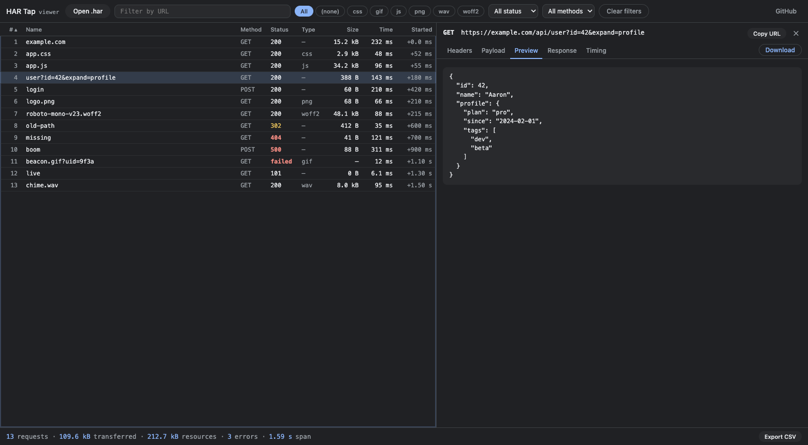

# HAR Tap

**HAR Tap** records a tab's network traffic into a standard **HAR 1.2** file and ships a zero-install,
**table-first viewer** to inspect it. The recorder is a small **Manifest V3** Chrome extension built on
[`chrome.debugger`](https://developer.chrome.com/docs/extensions/reference/api/debugger) — the same CDP
channel DevTools speaks (`Network.enable` + `responseReceived`/`loadingFinished` + `getResponseBody`) — so it
captures exactly what the DevTools Network panel sees, including **cross-origin (OOPIF) iframes** that a
naive top-frame tap misses.

The viewer is a request table + detail pane with filtering and search: open a finished capture straight
from the popup (**View**), or drop any `.har` from any tool into the page.

**Try the viewer live:** [aaronhg.github.io/har-tap](https://aaronhg.github.io/har-tap/) — drop in a `.har`,
or jump straight to [the bundled example capture](https://aaronhg.github.io/har-tap/?har=test/fixtures/sample.har)
(`?har=<url>` deep-links any same-origin/CORS-enabled HAR). The viewer is deliberately **table-first** —
no waterfall: filter, sort, inspect and export, built for finding and reading one request fast.

It is a load-unpacked developer tool. The `debugger` permission draws heavy Web Store review, and personal
use doesn't need a listing, so this isn't packaged for the store.

## Install (load unpacked)

1. `chrome://extensions`
2. toggle **Developer mode** (top-right)
3. **Load unpacked** → pick this folder
4. pin **HAR Tap** from the puzzle-piece menu

Reload after edits with the ⟳ button on its card (no build step).

## Use

1. Open the target tab. **Close DevTools on that tab** — only one debugger client per tab.
2. Click **HAR Tap** → **Start**. Chrome shows a yellow *"…is debugging this browser"* bar (expected; the
   page can't read it). With *Reload on start* checked it reloads so the first request ≈ navigation start.
3. Watch the live counter — entries, **wire** bytes (real `encodedDataLength` on the wire), embedded **bodies**
   (only shown when *Embed response bodies* is on), and a **frames** count if a cross-origin iframe attaches.
4. Click **Stop** to end the capture. The buttons become **Clear · Download · View**: **Download** saves
   `<host>.har` for Chrome DevTools → Network → import, or any HAR viewer; **View** opens the built-in
   viewer on the capture directly (no download round-trip). View is always available — with no saved
   capture it just opens the viewer's drop-a-file page.

If the active tab is a page `chrome.debugger` can't attach to (a `chrome://` settings page, the Web Store, …),
the button reads **Start in new tab** and captures the URL in a fresh tab instead — as long as *Reload on start*
is on and a URL is filled in (that new tab needs somewhere to navigate).

A finished capture is saved (`chrome.storage.local`, hence `unlimitedStorage`), so **View**/**Download** still
work after you close and reopen the popup. Starting a new capture or downloading clears it.

## Viewer

The viewer (`index.html`) is a request table with a detail pane:

- **Table** — `#` · Name · Method · Status · Type · Size · Time · Started; every column sortable. Started is
  the offset from the first request; Type is the URL's file extension. **Right-click the header** to choose
  visible columns and to switch the first column between **Name / Path / URL** (both persisted).
- **Filters** — URL substring, file-extension chips built from what's actually in the file (busiest first,
  `(none)` for extension-less requests), status class / "Errors only", and method.
- **Detail pane** — Headers · Payload · Preview · Response · Timing tabs; drag the divider to resize.
- **Keyboard** — `↑`/`↓` walk the table, `←`/`→` cycle the detail tabs, `Enter` jumps into the pane,
  `Esc` comes back.
- **Export CSV** (stats bar) — the filtered rows in their current order with exactly the visible columns,
  machine-friendly values (the first column exports whatever mode it shows; sizes in bytes, times in ms).

**Preview** is the rendered view, DevTools-style — prettified JSON, inline images, `<audio>`/`<video>` players
playing the *captured* bytes (not a re-fetch) — while **Response** is the raw text plus size/MIME meta; a
**Download** button in the tab bar's corner saves the body. All of that needs the body in the HAR (*Embed
response bodies* — HAR-standard `content.text`, so foreign HARs with bodies work too).

Opened via the popup's **View** button it auto-loads the last capture from `chrome.storage.local`. It is
otherwise a plain page — everything is parsed locally, and it runs from `file://` too: double-click
`index.html` and drop any `.har` (from DevTools, Firefox, WebPageTest, …) onto it.

### Hosted viewer (GitHub Pages)

The viewer is plain static files, so GitHub Pages serves it as-is: **Settings → Pages → Deploy from a
branch → `main` / `/ (root)`** (`.nojekyll` keeps it raw). `https://aaronhg.github.io/har-tap/` IS the
viewer — the root `index.html` is the app, no redirect.

`?har=<url>` deep-links a HAR: the bundled example is [`/?har=test/fixtures/sample.har`](https://aaronhg.github.io/har-tap/?har=test/fixtures/sample.har)
(also linked from the empty state); same-origin URLs always work, a cross-origin URL needs that server to
send CORS headers. Hosted or not, parsing stays entirely in the page — no HAR bytes leave the browser.

## Files

| file | role |
|---|---|
| `manifest.json` | MV3, `debugger` + `tabs` + `storage` + `unlimitedStorage` permissions, module service worker |
| `core/har.js` | **pure** HAR-entry builder (no `chrome.*`, no Node) — unit-testable in isolation |
| `core/capture-core.js` | the reusable capture engine: owns the `chrome.debugger` session, wires CDP events → `HarTap`, handles OOPIF auto-attach. Exposes plugin hook seams (see the file header) so a superset consumer can layer on features without forking it |
| `core/popup-core.js` | the reusable popup engine: Start · Stop → Clear·Download·View, URL + option persistence, live counter, Blob download of `<host>.har`, with option-input / results-panel seams |
| `background.js` / `popup.js` | thin entry points — wire the `core/` engines with **no plugins**, i.e. the plain tool |
| `popup.html` | the popup markup (includes empty `#opt-slot` / `#panel-slot` a plugin fills) |
| `index.html` + `viewer/viewer.js` / `.css` | the viewer page (the repo root IS the app — it doubles as the GitHub Pages site, no redirect): request table + resizable detail pane (Headers · Payload · Preview · Response · Timing), file-extension/status/method/text filters, sortable columns, stats footer. A **pure** web page — the only `chrome.*` touch is feature-detected storage read, so it also works from `file://` with drag-and-drop (classic scripts, no ES modules: Chrome blocks module imports on `file://`) |
| `viewer/lib.js` | the viewer's **pure** helpers (formatting, URL/extension parsing, body classification, CSV) — no DOM, no `chrome.*`, loaded before `viewer.js` |
| `test/` | `node:test` suites for `core/har.js` (CDP events → HAR) and `viewer/lib.js`; `npm test`, zero dependencies. `test/fixtures/sample.har` is a 13-entry HAR covering the type/status/body matrix (doubles as the viewer's `?har=` example) |
| `icons/` · `docs/` | extension + favicon PNGs (script-generated, no binary sources) · the README screenshot |
| `.github/workflows/test.yml` | CI: `npm test` on every push/PR |

`core/har.js`/`core/capture-core.js` and `viewer/lib.js`/`viewer/viewer.js` are split along the same "pure
logic vs. browser glue" line: the pure halves run unchanged in Node, where `test/` exercises them — run
`npm test` (Node's built-in `node:test`, no dependencies to install). The `core/` engines take plugin hooks
but run with none here, so a superset build (e.g. via a git submodule of this repo) reuses `core/` verbatim
and adds its layer through the seams rather than copying these files.

## Byte accounting — the warm-cache trap

Sizing a capture from `encodedDataLength` alone is unreliable: on a warm cache, a cache hit reports
`encodedDataLength: 0`, so those assets would log 0 bytes. Two mitigations, both here:

- **disable cache** (checkbox, default on) — sends `Network.setCacheDisabled` for the whole session, so every
  request goes over the wire and `encodedDataLength` is real. Unlike `Page.reload`'s `ignoreCache` (which only
  covers the reload's own requests, not later runtime XHR/image loads).
- **embed bodies** (checkbox) — pulls each body via `getResponseBody` into HAR-standard
  `content.text`(+`encoding:base64`) and sets `content.size` to the **decoded** length. Note binary bodies
  come back as base64, so no text re-encoding corruption. Cache-disable alone gives wire-byte sizes; embedding
  bodies is what yields decoded sizes for gzipped text.

## Cross-origin iframes (OOPIF)

A page embedded in a **cross-origin `<iframe>`** becomes an out-of-process iframe: a separate renderer and a
separate CDP target the top-tab Network tap can't see. `core/capture-core.js` arms
`Target.setAutoAttach {autoAttach, waitForDebuggerOnStart, flatten:true}` on the root before reload. Each child
frame then auto-attaches: it gets its own `Network.enable` + `setCacheDisabled`, re-arms `setAutoAttach` on
itself (auto-attach is **not** recursive — every session must arm its own children), and
`runIfWaitingForDebugger` (the frame is paused at start, so no request is missed).

Child events arrive via `onEvent` with `source.sessionId`. RequestIds are only unique per-session, so `HarTap`
namespaces its request map by `(sessionId, requestId)` or cross-frame requests would collide. The popup shows
a **frames** count once >1 so you can see a child frame attach. (Requires a Chrome with `chrome.debugger`
`sessionId` support — ~M125+.)

## Limits

- **New tab / window**: capture is per attached tab. Content opened in a *new tab* (not an iframe) isn't
  followed — start the capture on that tab.
- **MV3 SW lifetime**: entries live in the service worker's memory. A dense load burst keeps it warm, but a
  long idle mid-capture could evict it.

## License

MIT — see [LICENSE](LICENSE).
